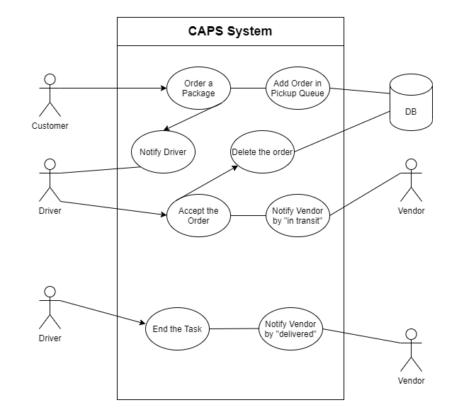

# LAB - 11

## caps
A real-time service that allows for vendors, such as flower shops or restaurants, to alert a system of a package needing to be delivered, for drivers to instantly see what’s in their pickup queue, and then to alert the vendors as to the state of the deliveries (in transit, and then delivered).


### Author: Mohammad Za'areer

- [tests report](https://github.com/401-JS-Mohammad-Zaareer/caps/actions)

### Setup

#### `.env` requirements

- `STORE_NAME` - Store Name

#### Running the app

- `npm start`
- Endpoint: `/`
  - Returns Object

    ```javascript
    EVENT {
       event: 'in-transit',
       time: '2021-5-25 T17:46:30.561Z',
       payload: {
         storeName: 'Smart-Drones',
         orderId: '5d0fcf46-43a6-4526-b168-19c51eb33f4f',
         customerName: 'Ora Welch',
         address: '6767 Rosenbaum Junctions'
    }
    ```

#### Tests

- Unit Tests: `npm run test`
- Lint Tests: `npm run lint`

#### UML
